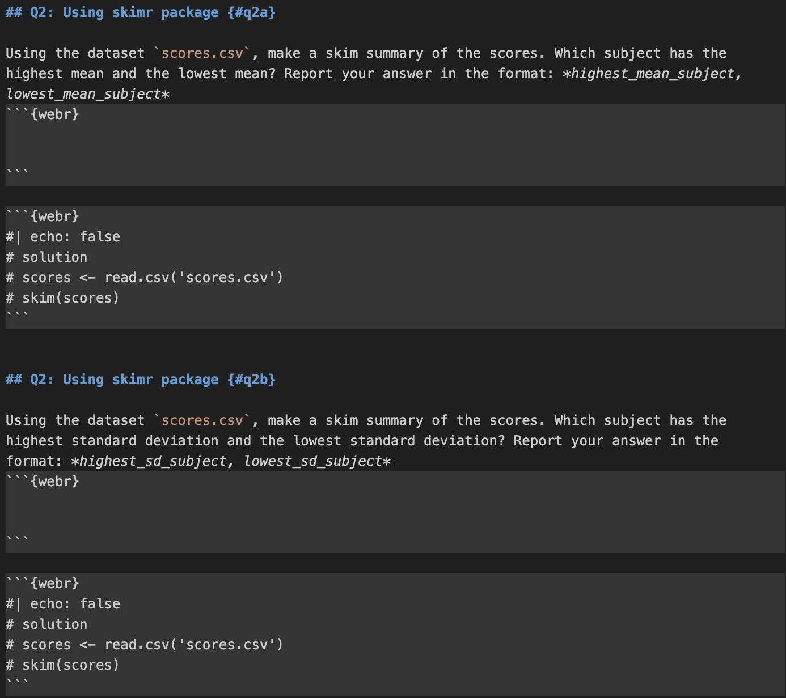
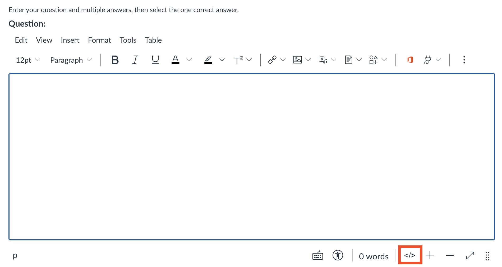

# Pre-requisites
- R packages
- R version
- LaTeX
- Quarto

# Introduction
Hello! Here you will find documentation for the quizzes, including how to add/delete/edit questions, adding files, navigating errors, and more.
We use `.qmd` files to create the quizzes. Each quiz is written in a Quarto (`.qmd`) file that contains the quiz questions, code chunks, and required datasets. The `.qmd` file is then rendered into an HTML page. The generated HTML file is embedded into Quercus using an iframe so students can access the quiz directly from the course page.

# Folder Structure

Each quiz is stored in its own folder. The folder contains the `.qmd` file and the dataset CSV files used in the quiz.

Example structure:

```text
Quiz6/
  quiz6.qmd
  soccer_spi.csv
  music_tracks.csv
  game_publishers.csv
  training_scores.csv
```

This structure keeps the quiz file and its datasets organized in one location.

# Quiz File Structure

Each `.qmd` quiz file contains several components.

The `.qmd` file includes the required dataset files and the JavaScript code used for the HTML implementation. For each question, the file contains a question description, a `webr` code chunk that students interact with, and another `webr` chunk that is hidden from students and contains the solution and the final answer.

# Adding files
Files, such as csv files, are added on top of the qmd file, under `resouces`. For example, in `quiz3a.qmd`, we use two csv files, `task_times.csv` and `scores.csv`. We add these files under resources, as such:

```html
---
title: "Quiz 3a"
format: live-html
engine: knitr
sidebar:
  style: docked
resources:
  - scores.csv
  - task_times.csv
---
```

# JavaScript for Question Display

The `.qmd` file includes a JavaScript script that reads the URL parameter and hides the other questions.

```html
<script>
document.addEventListener("DOMContentLoaded", () => {
  const params = new URLSearchParams(window.location.search);
  const showQ = params.get("q");

  if (showQ) {
    document.querySelectorAll("section[id]").forEach(section => {
      if (section.id !== showQ) section.style.display = "none";
    });
  }

  document.querySelectorAll(".quarto-title-block")
    .forEach(el => el.style.display = "none");

  document.querySelectorAll("section[id] > h2")
    .forEach(h => h.style.display = "none");
});
</script>
```

This script reads the `q` parameter from the URL, displays only the requested question, and hides the page title and section titles.

# Supressing Library Import Output

To hide/supress library imports, nest the library calls inside `suppressMessages`. For example in a webR block,

```html
#| echo: false
invisible(capture.output({
  suppressMessages(library(ggplot2))
  suppressMessages(library(skimr))
}))
```
This code block supresses messages while importing the libraries ggplot2 and skimr.

# Questions and Student Code

The first few quizzes typically have two files, where they contain two versions of the quizzes. In later quizzes, each question has two versions on the same file. For example, for question 2, there would be Q2a and Q2b. 
Each of these questions have a `webr` block, where students can enter their R code. 

The solutions are displayed on the same qmd file underneath where students enter their code, with `#| echo: false`.
This command (`#| echo: false`) prevents the webr block from being shown. Some files may also have `#| output: false` in the solution block, which prevents the output from being displayed.


# Embedding in Quercus

After rendering the `.qmd` file into HTML, the quiz page is embedded into Quercus using an iframe. Click on the `</>` symbol to embed a quiz question into Quescus.


Click on the same button again to view the embedded question.

Example HTML:

```html
<p>
<iframe
title="embedded content"
src="https://nishanmudalige.github.io/STA258_Quiz_Questions/Quiz6/quiz6.html?q=q2a"
width="100%"
height="650px"
loading="lazy">
</iframe>
</p>
```
This allows students to access the interactive quiz directly inside Quercus.

# Displaying a Specific Question

Each quiz HTML page may contain multiple questions. A URL parameter is used to display a specific question.

Example URL, located in `src` of the embedded HTML:

https://nishanmudalige.github.io/STA258_Quiz_Questions/Quiz6/quiz6.html?q=q2a

`https://nishanmudalige.github.io/STA258_Quiz_Questions` is the website where all the quizzes are located. `Quiz6` is the folder at which the specific quiz is. `quiz6.html` is the quiz file, and `q=q2a` displays the specific question, question 2 version A.
The `q` parameter indicates which question should be displayed.

# Errors

### NotReadableError
Sometimes, the following error may show up: 
```html
NotReadableError: Failed to execute 'readAsArrayBuffer' on 'FileReaderSync': The 
requested file could not be read, typically due to permission problems that have 
occurred after a reference to a file was acquired
```
Typically, the error disappears after refreshing the page. If the error still persists, run the command `quarto add coatless/quarto-webr` in terminal.
Then, run `quarto clean` and then `quarto render` to reload all the files.

# Common Commands
### quarto clean
`quarto clean` is used to tidy up all the extra files that Quarto creates when you render a document.

To clean all output formats, run `quarto clean --all`.

### quarto preview
`quarto preveiw` lets you render your .qmd document on the fly without creating final output files in your project folder or having to push your code.
It automatically refreshes in the browser when you save changes, and is great for checking formatting, plots, and code outputs before doing a full render.

