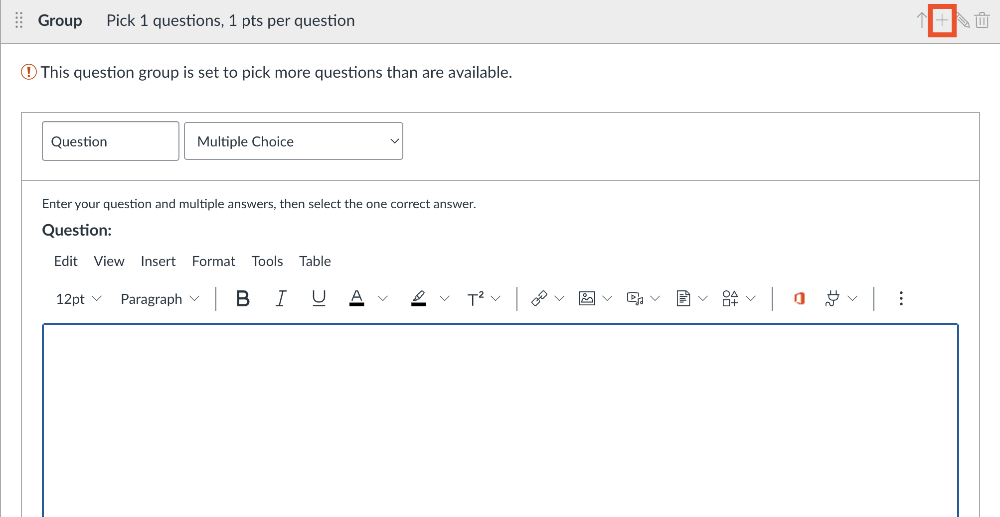
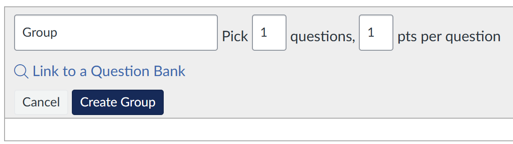

# Documentation
*Authors: Giodanno Limin and Rithika Yerra*

## Table of Contents

- [Pre-requisites](#pre-requisites)
- [Introduction](#introduction)
- [Quercus Constraints (Randomization & Independence)](#quercus-constraints-randomization--independence)
- [Folder Structure](#folder-structure)
- [Quiz File Structure](#quiz-file-structure)
- [Adding files](#adding-files)
- [Required Extensions and Question Display](#required-extensions-and-question-display)
- [JavaScript for Question Display](#javascript-for-question-display)
- [Supressing Library Import Output](#supressing-library-import-output)
- [Questions and Student Code](#questions-and-student-code)
- [Adding Questions and Question Bank](#adding-questions-and-question-bank)
- [Question Randomization Methods](#question-randomization-methods)
- [Creating and Using Question Banks in Quercus](#creating-and-using-question-banks-in-quercus)
- [Embedding in Quercus](#embedding-in-quercus)
- [Displaying a Specific Question](#displaying-a-specific-question)
- [Errors](#errors)
- [Common Commands](#common-commands)


## Pre-requisites
- R (version 4.3+ recommended)
- R packages
- LaTeX
- Quarto

## Introduction
Hello! Here you will find documentation for the quizzes, including how to add/delete/edit questions, adding files, navigating errors, and more.
We use `.qmd` files to create the quizzes. Each quiz is written in a Quarto (`.qmd`) file that contains the quiz questions, code chunks, and required datasets. The `.qmd` file is then rendered into an HTML page. The generated HTML file is embedded into Quercus using an iframe so students can access the quiz directly from the course page.

## Quercus Constraints (Randomization & Independence)
In Quercus, randomization occurs at the question level, not at the quiz level.

This means:

- Each question is selected independently from the question bank
- Students may receive different versions of each question (e.g., Version A or Version B)

As a result, it is not possible to assign a student a single consistent version of the entire quiz (e.g., all Version A or all Version B questions).

For example:

- A student may receive Q1 Version A, Q2 Version B, Q3 Version A, etc.
- The versions are mixed across the quiz

Because of this:

- Questions must be fully independent
- You cannot design questions that depend on a shared dataset or results from a previous question
- You cannot create “Quiz Version A” and “Quiz Version B” as complete sets

Additionally, each question is rendered inside an iframe, so:

- R code is executed separately for each question
- Variables are not shared across questions

To handle this limitation:

- Each question version (A or B) must be self-contained
- Any required data, code, or calculations must be included within that question

## Folder Structure

Each quiz is stored in its own folder. The folder contains the `.qmd` file and the dataset CSV files used in the quiz.

Example structure:

```text
Quiz6/
  quiz6.qmd
  soccer_spi.csv
  music_tracks.csv
  game_publishers.csv
  training_scores.csv
```

This structure keeps the quiz file and its datasets organized in one location.

## Quiz File Structure

Each `.qmd` quiz file contains several components.

The `.qmd` file includes the required dataset files and the JavaScript code used for the HTML implementation. For each question, the file contains a question description, a `webr` code chunk that students interact with, and another `webr` chunk that is hidden from students and contains the solution and the final answer.

## Adding files
Files, such as csv files, are added on top of the qmd file, under `resouces`. For example, in `quiz3a.qmd`, we use two csv files, `task_times.csv` and `scores.csv`. We add these files under resources, as such:

```html
---
title: "Quiz 3a"
format: live-html
engine: knitr
sidebar:
  style: docked
resources:
  - scores.csv
  - task_times.csv
---
```

## Required Extensions and Question Display

Each quiz `.qmd` file should include the following line near the top of the file, after the YAML header:

``

Purpose:
- `_knitr.qmd` enables execution of R code blocks in the browser using WebR

### Optional Extension

The following extension is included in some quizzes:

``

- `_gradethis.qmd` enables automatic grading and feedback for student answers
- This is optional and may not be used in all quizzes

### Defining Question IDs

Each question must have a unique section ID. For example:

`## Q1 — Visualize the Relationship {#q1a}`

The ID (`q1a`) is used by the JavaScript to determine which question to display.

This ID must match the `q` parameter in the URL. For example:

`quiz10.html?q=q1a`

This will display only the section with ID `q1a`.

### JavaScript for Question Display

Each `.qmd` file includes a JavaScript script placed below the YAML header and below the include lines.

Example structure:

```html
---
title: "quiz10"
title-block-style: none
format: live-html
engine: knitr
sidebar:
  style: docked
resources:
  -  marketing_A.csv
  -  marketing_B.csv
---




<script>
document.addEventListener("DOMContentLoaded", () => {
  const params = new URLSearchParams(window.location.search);
  const showQ = params.get("q");

  if (showQ) {
    document.querySelectorAll("section[id]").forEach(section => {
      if (section.id !== showQ) section.style.display = "none";
    });
  }

  document.querySelectorAll(".quarto-title-block")
    .forEach(el => el.style.display = "none");

  document.querySelectorAll("section[id] > h2")
    .forEach(h => h.style.display = "none");
});
</script>
```

How it works:

- The script reads the `q` parameter from the URL
- It displays only the matching question section
- All other question sections are hidden
- The page title and section titles are also hidden for a cleaner embedded view in Quercus

This allows a single `.qmd` file to contain multiple questions while displaying only one question at a time inside an iframe.

## Supressing Library Import Output

To hide/supress library imports, nest the library calls inside `suppressMessages`. For example in a webR block,

```html
#| echo: false
invisible(capture.output({
  suppressMessages(library(ggplot2))
  suppressMessages(library(skimr))
}))
```
This code block supresses messages while importing the libraries ggplot2 and skimr.

## Questions and Student Code

The first few quizzes typically have two files, where they contain two versions of the quizzes. In later quizzes, each question has two versions on the same file. For example, for question 2, there would be Q2a and Q2b. 
Each of these questions have a `webr` block, where students can enter their R code. 

The solutions are displayed on the same qmd file underneath where students enter their code, with `#| echo: false`.
This command (`#| echo: false`) prevents the webr block from being shown. Some files may also have `#| output: false` in the solution block, which prevents the output from being displayed.


## Adding Questions and Question Bank
To create a question, go to "Questions" in the quiz creation tool and click on "New Question". 
To create questions that belong to a question bank (e.g. create two versions of one question) one method is creating a group within the quiz.
First, click on "New Question Group". 
Then, after naming the Question Bank, click on "Create Group". Click on the "+" sign to add a question.
 

The question types can be selected at the top of the Question box. A more detailed explanation on how to create groups, for instance if you would like to create a question group that can be used across many quizzes, is located in the "Question Randomization Methods" section.

 Choose "Numerical Answers" for numerical-based answers. An error margin can be chosen here as well. For text-based or interpretation questions, "Multiple Choice" or "Multiple Answers" is typically sufficient.

For confidence interval related questions, where we want the student to enter multiple numeric answers, select "Fill In Multiple Blanks". Use `[]` to enter variable names (i.e. `lower bound is [lower_bound]`) and enter the correct answer below in "Answers". Change the variable by clicking on the drop down menu next to "Show Possible Answers for". Note that this is a text box, not a numeric box, so students that enter "1" instead of "1.0000" would be marked incorrect. For such situations, it's recommended to have many answers (i.e. if the answer is 1, have solutions "1", "1.0000"). 

## Question Randomization Methods

In this project, there are two approaches to implement multiple versions of questions in Quercus:

### 1. Question Groups (Inside Quiz)

- Questions are created directly within the quiz
- Randomization is handled within each Question Group
- Simpler to set up, but less reusable across quizzes

### 2. Question Banks (External)

- Questions are created in external Question Banks
- Linked into the quiz using Question Groups
- Each Question Group pulls from one Question Bank

Workflow:

1. Create questions in a Question Bank 
2. In the quiz, create a Question Group
3. Click "Link to a Question Bank"
4. Select the appropriate bank

Advantages:

- Reusable across multiple quizzes
- Cleaner organization

Limitations:

- Slower to implement, since each question requires its own Question Bank with multiple versions (e.g., A and B)
- Harder to preview all questions at once, since each Question Bank must be opened separately

---

## Creating and Using Question Banks in Quercus

To create and use Question Banks for randomization:

### Step 1 — Create a Question Bank


1. Go to the **Quizzes** page  
2. Click the three dots menu next to **+ Quiz**  
3. Select **Manage Question Banks**  
4. Click **Add Question Bank**  
5. Enter a name for the bank and press Enter  

### Step 2 — Add Questions to the Bank

1. Click the created Question Bank  
2. Click **Add Question**  
3. Add different versions of the same question (e.g., Version A and Version B)  

### Step 3 — Link the Bank to a Quiz

1. Go to the quiz and open the **Questions** tab  
2. Click **New Question Group**  
3. Enter a group name  
4. Click **Link to a Question Bank**  
5. Select the appropriate Question Bank  
6. Click **Create Group**



Each Question Group should be linked to one Question Bank, so each quiz question is mapped to exactly one bank.

Important:

- Randomization occurs at the question level, not the quiz level
- Students may receive mixed versions (e.g., Q1A, Q2B, Q3A), not a full Version A or Version B quiz


## Embedding in Quercus

After rendering the `.qmd` file into HTML, the quiz page is embedded into Quercus using an iframe. Click on the `</>` symbol to embed a quiz question into Quescus.

{fig-align="center" width="80%"}

Click on the same button again to view the embedded question.

Example HTML:

```html
<p>
<iframe
title="embedded content"
src="https://nishanmudalige.github.io/STA258_Quiz_Questions/Quiz6/quiz6.html?q=q2a"
width="100%"
height="650px"
loading="lazy">
</iframe>
</p>
```
This allows students to access the interactive quiz directly inside Quercus.

## Displaying a Specific Question

Each quiz HTML page may contain multiple questions. A URL parameter is used to display a specific question.

Example URL, located in `src` of the embedded HTML:

https://nishanmudalige.github.io/STA258_Quiz_Questions/Quiz6/quiz6.html?q=q2a

`https://nishanmudalige.github.io/STA258_Quiz_Questions` is the website where all the quizzes are located. `Quiz6` is the folder at which the specific quiz is. `quiz6.html` is the quiz file, and `q=q2a` displays the specific question, question 2 version A.
The `q` parameter indicates which question should be displayed.

## Errors

### NotReadableError
Sometimes, the following error may show up: 
```html
NotReadableError: Failed to execute 'readAsArrayBuffer' on 'FileReaderSync': The 
requested file could not be read, typically due to permission problems that have 
occurred after a reference to a file was acquired
```
Typically, the error disappears after refreshing the page. If the error still persists, run the command `quarto add coatless/quarto-webr` in terminal.
Then, run `quarto clean` and then `quarto render` to reload all the files.

## Common Commands
### quarto clean
`quarto clean` is used to tidy up all the extra files that Quarto creates when you render a document.

To clean all output formats, run `quarto clean --all`.

### quarto preview
`quarto preview` lets you render your .qmd document on the fly without creating final output files in your project folder or having to push your code.
It automatically refreshes in the browser when you save changes, and is great for checking formatting, plots, and code outputs before doing a full render.
